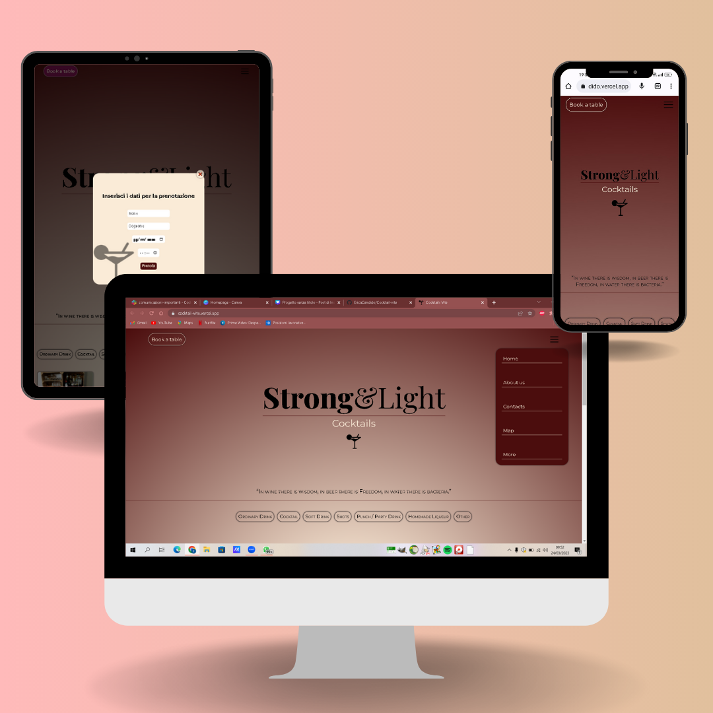

# Cocktail-vite
Progettino realizzato con Vite, sito vetrina interattivo 🤩

# Scheda tecnica 📊
 
 🖧  API: https://www.thecocktaildb.com/api.php  
 
 👩‍💻 Linguaggio di programmazione: JSX  
 
 🖼️ Framework: React  
 
 🎨 Style: SASS & CSS Modules 
 
 
